<div align="center">

# Sands

**A floating hourglass timer for [DankMaterialShell](https://github.com/AvengeMedia/DankMaterialShell).**

Type `timer 20 min pasta` in the launcher. Watch the sand fall in your bar.
Pause it and the whole thing freezes over.

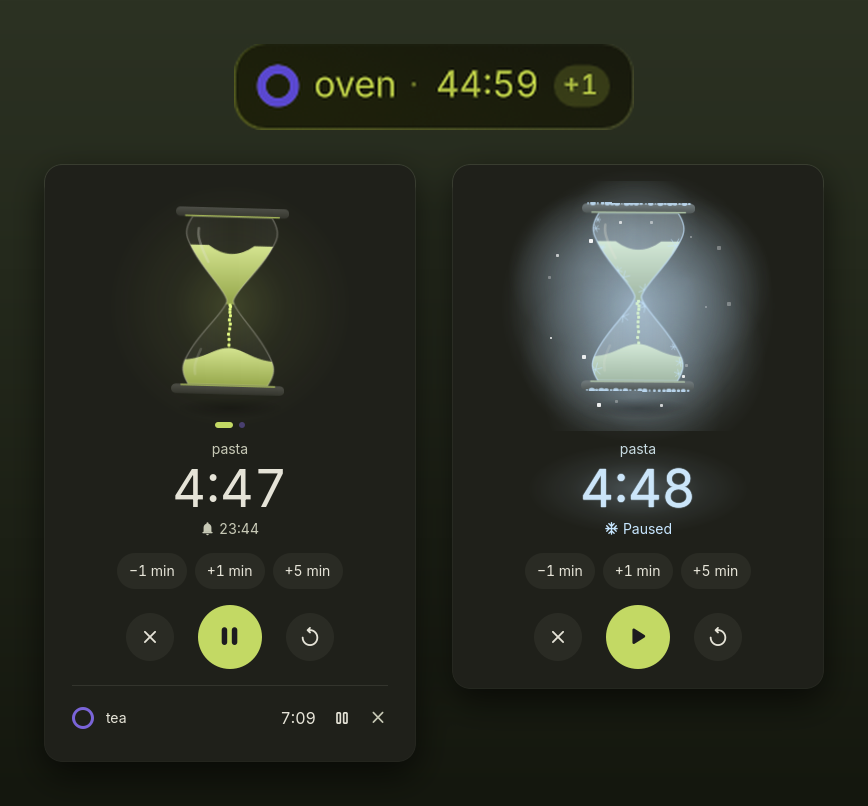

</div>

**New in 1.2.1:** *Reduce motion* is honored everywhere, and a *Privacy* section explains what Sands runs and stores. See the [changelog](#changelog) and the [roadmap](#roadmap).

---

## Why Sands

Most timers make you click through a form. Sands gets out of the way:

- **Zero forms.** One line in the launcher starts a timer: `25m`, `1h30 oven`, `at 6pm`.
- **Zero clutter.** The bar pill only exists while a timer runs.
- **Zero guessing.** A ring drains in the bar; the sand in the panel is synced to the real remaining time *by volume*, not by height.
- **Delightful, yet light.** The hourglass floats, flips when you restart, and freezes when you pause — without redrawing anything it doesn't have to.
- **Matches your theme.** Every color comes from your DMS theme — static or generated from your wallpaper — and updates live when it changes. The screenshots use a lime theme; on the default purple theme, Sands is purple.

## Use cases

| When you… | Type |
|---|---|
| boil pasta, steep tea, bake | `timer 11 min pasta`, `4m tea`, `45 min oven` |
| focus in blocks | `25m focus`, then `5m break` from the recents |
| need to leave at a given time | `at 18:30 train`, `timer 7am wake up` |
| run several things at once | start as many as you want — each gets its own color |
| cook with the laundry going | `1h laundry` + `12m pasta`: the pill shows the next one, `+1` for the rest |
| play, meet, stretch | `timer 50 min meeting`, `timer 1 hour and a half` |
| want a timer without the mouse | bind a key to open the launcher pre-filled with `timer ` |

## Features

### In the bar

| | |
|---|---|
| 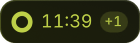 | **Running** — a ring drains, digits never jitter (tabular figures, fixed width). `+1` means another timer is running. |
| 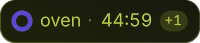 | **Name on demand** — shown for two seconds when a timer starts, and whenever you hover. Hovering never opens anything. |
| 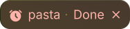 | **Done** — the pill grows red and breathes, the alarm loops, a notification offers *Stop* and *+5 min*. |

The ring turns amber during the last minute and beats during the last ten seconds.

| Gesture on the pill | Action |
|---|---|
| Left click | Open the panel (silences the alarm) |
| Right click | Pause / resume — or stop the alarm |
| Scroll | ±1 minute (scroll up on a finished timer = snooze 1 min) |
| Middle click | Cancel |

### The panel

<table>
<tr>
<td align="center">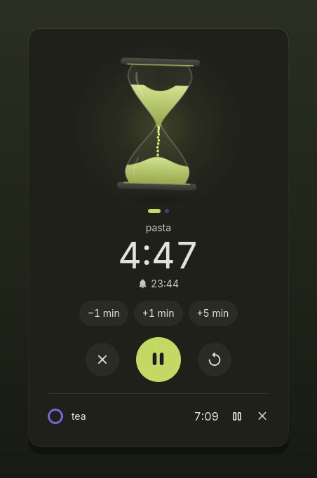<br><b>Running</b></td>
<td align="center">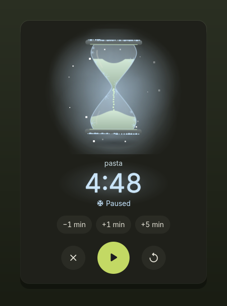<br><b>Paused — frozen</b></td>
</tr>
<tr>
<td align="center">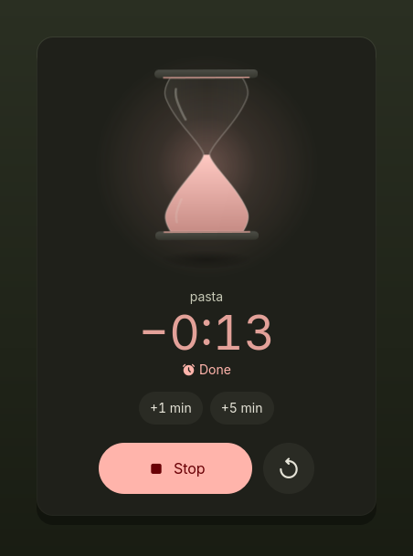<br><b>Done</b></td>
<td align="center">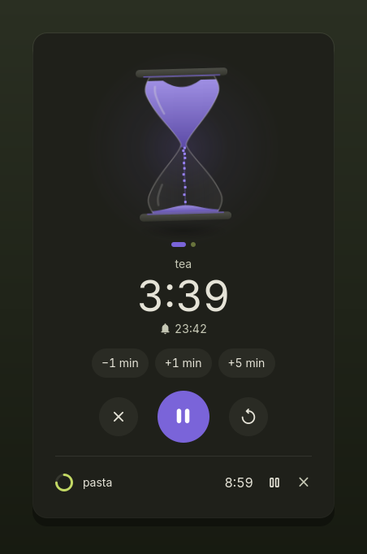<br><b>Every timer has its color</b></td>
</tr>
</table>

**Colors follow your DMS theme.** The first timer uses your accent color; each additional timer gets a harmonious hue derived from it, used everywhere for that timer: the sand, the ring in the bar, the main button, the dots and the list. Alerts use the theme's warning (last minute) and error (done) colors.

- **A floating hourglass.** It levitates, tilts, and casts a breathing shadow.
- **Sand synced by volume.** The bulbs' profile is integrated, so at half time exactly half the sand is left on top — a dip forms above, a mound grows below, grains stream through the neck.
- **Freeze on pause.** Time slows to a stop, grains hang mid-air, the hourglass keeps floating — slower, like at absolute zero. Frost settles on the glass and the caps, a cold mist drifts, the digits turn ice-blue. It thaws just as smoothly.
- **Flip to restart.** The hourglass turns over and starts again.
- **Two hourglasses.** The classic one, or **Glass of Time** — a nod to Steven Universe: the glass floats in a cyan sphere with a gold ring around its waist. Only the frame changes; the sand, the freeze and the flip behave exactly the same.

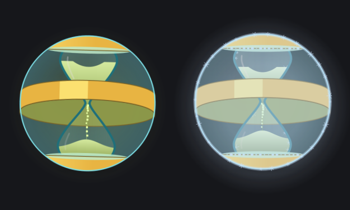

| Pause → freeze → thaw | Restart → flip |
|---|---|
| 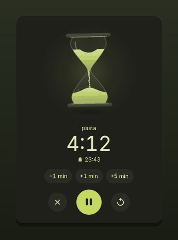 | 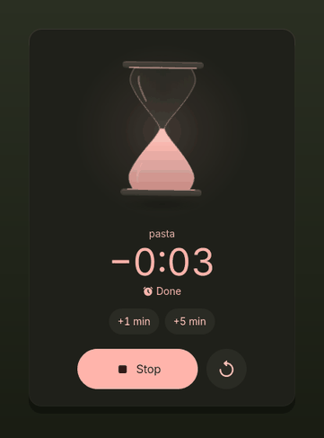 |

| Gesture on the hourglass | Action |
|---|---|
| Click | Flip it (restart) |
| Scroll | ±1 minute |
| Swipe / horizontal scroll | Next or previous timer (dots show where you are) |
| `Space` / `Esc` | Pause–resume / close |

### The launcher

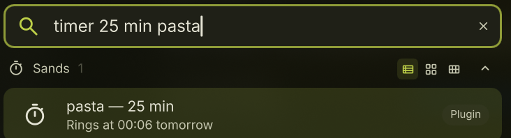

No prefix needed: Sands only answers when what you type looks like a duration, and stays silent for everything else. Type `timer` alone to get your most used timers first (frequent *and* recent), then 5, 10 and 25 min, then the running ones.

## Syntax

English and French, words or digits, in any order:

| Input | Result |
|---|---|
| `20 min`, `20m`, `timer 20` | 20 minutes |
| `1h30`, `1h 30`, `1.5h`, `1,5 h`, `90 min` | 1 hour 30 |
| `1h30m20s`, `5m30`, `90s`, `1:30`, `1:02:03` | exact durations (`1:30` = 1 min 30 s) |
| `half an hour`, `an hour and a half`, `twenty five minutes` | spelled-out durations |
| `une demi-heure`, `trois quarts d'heure`, `2 heures et quart` | same in French |
| `12 min pasta`, `pasta 12 min`, `pasta for 12 min` | a named timer |
| `at 18:30`, `at 6pm`, `at noon`, `à 18h` | an alarm at a time of day (tomorrow if already past) |
| `timer 14h30` | offers both: *alarm at 14:30* first, *14 h 30 timer* second |

The parser is covered by 91 tests: `gjs tests/parser.test.js`.

## Settings

Settings → Plugins → **Sands**

| Setting | Default |
|---|---|
| Language — automatic, English, Français | automatic |
| Hourglass — Classic or Glass of Time | Classic |
| Sound — any installed sound theme file, or your own `.oga/.ogg/.wav/.mp3/.flac` (with *Preview*) | alarm clock |
| Volume | 80 % |
| Alarm duration — the sound stops by itself, the pill keeps pulsing | 60 s |
| Gentle alarm — starts at 30 %, rises to full volume | on |
| Final countdown ticks — a soft tick on each of the last 10 seconds | off |
| Respect Do Not Disturb — no sound, the pill still pulses | on |
| Notification when done — with *Stop* and *+5 min* | on |
| Automatic detection in the launcher, or a prefix of your choice | automatic |

DMS's *Reduce motion* setting is respected: no floating, no flip animation.

## Command line & keybindings

```sh
dms ipc call smartTimer start "12 min pasta"   # same syntax as the launcher
dms ipc call smartTimer toggle                 # pause/resume the next timer, or stop the alarm
dms ipc call smartTimer stop                   # stop the alarm, or cancel the next timer
dms ipc call smartTimer add 5                  # +5 min to the next timer
dms ipc call smartTimer list
dms ipc call smartTimer clear
dms ipc call smartTimer panel                  # open/close the panel on the focused screen
dms ipc call smartTimer lang en                # en, fr or auto
dms ipc call launcher openQuery "timer "       # launcher pre-filled, ready to type a duration
```

**niri** (`~/.config/niri/config.kdl`):

```kdl
binds {
    Mod+T       { spawn "dms" "ipc" "call" "launcher" "openQuery" "timer "; }
    Mod+Shift+T { spawn "dms" "ipc" "call" "smartTimer" "panel"; }
}
```

**Hyprland**:

```ini
bind = SUPER, T, exec, dms ipc call launcher openQuery "timer "
bind = SUPER SHIFT, T, exec, dms ipc call smartTimer panel
```

## Install

Requires DankMaterialShell ≥ 1.6 and `pw-play` (PipeWire; `paplay` is used as a fallback).

1. Put this folder in `~/.config/DankMaterialShell/plugins/`.
2. Settings → Plugins → *Scan for plugins*, then enable **Sands**.
3. Settings → Appearance → DankBar Layout → add **Sands** to a section (the center looks best).

Timers survive a DMS restart: they are stored as end times, not countdowns.

## Privacy

- No network access, no telemetry.
- The only processes are short-lived local tools: `pw-play` (or `paplay`) to ring, `notify-send` / `gdbus` for the notification, and a one-off `find` over the system sound folders while the settings page is open, to list the sounds you can pick.
- Written to disk, through DMS's own plugin state: your running timers (end times and labels, so they survive a restart) and your recent timers (to suggest them again in the launcher). Nothing else.
- Settings are stored by DMS with your other plugin settings.

## Performance

Sands is built to cost nothing while you are not looking at it.

- **Engine:** wakes up exactly when a displayed second changes (≈ once per second), not at all when everything is paused. The sorted list is only recomputed when timers change.
- **Hourglass:** glass and sand are redrawn only when the sand level moves by at least a quarter pixel; only visible jumps are smoothed. Floating, grains and the flip are plain GPU transforms.
- **Pulses, glints, mist, ringing:** Qt Quick *Animators* — they run on the render thread, with zero JavaScript per frame.
- **Closed panel:** every animation stops.
- **Reduce motion:** the hourglass stops floating and flipping, the pill no longer beats or shakes, and the frost crystals stay still.

## Project layout

```
plugin.json                 manifest (composite: daemon + bar widget + launcher)
TimerDaemon.qml             engine: timers, persistence, sound, notifications, IPC
TimerWidget.qml             bar pill + native DMS popout
TimerLauncher.qml           launcher provider
TimerSettings.qml           settings page
TimeParser.js               natural-language parser + formatting (tested)
L10n.js                     English / French strings
components/
  TimerPanelContent.qml     panel: hourglass, time, controls, other timers
  Hourglass.qml             the floating, volume-synced hourglass
  ProgressRing.qml          the ring used in the pill and lists
  RoundButton.qml, Chip.qml
tests/parser.test.js        gjs tests/parser.test.js
docs/images/                screenshots and animations
```

> The plugin id is `smartTimer` (settings, IPC target and saved state use it); the display name is **Sands**.

## Changelog

### 1.2.1 (2026-09-26)
- *Reduce motion* is honored everywhere: no beat or bell shake in the pill, still frost crystals, and no frames at all while a paused hourglass stands still.
- New *Privacy* section in this README.
- Code comments and test output in English only.

### 1.2.0 (2026-09-26)
- New *Hourglass* setting: *Classic*, or *Glass of Time* (a nod to Steven Universe: the glass in a cyan sphere, a gold ring around the waist). Sand, freeze and flip behave the same.

### 1.1.0 (2026-09-24)
- First release: natural-language timers in French and English from the launcher, the bar pill with its ring, the floating hourglass that freezes when paused and flips on restart, several named timers with their own theme color, timers that survive a restart.
- Progressive ringing, a final tick, Do Not Disturb, a notification with Stop and +5 min, `dms ipc call smartTimer …` commands.

## Roadmap

Ideas, not promises, and no dates. Sands stays a simple timer: no network, nothing sent anywhere.

- **Lighter open panel**: the floating hourglass redraws in sync with the display while the panel is open; move its slow float to a plain timer, measured before and after (the same work already done for Orbit Bluetooth).
- **Light theme**: check every state with a light DMS theme.
- **Easier to read code**: split the largest files (`TimerPanelContent.qml`, `Hourglass.qml`, `TimerDaemon.qml`) by role, without changing behavior.

## License

MIT — see [LICENSE](LICENSE).
