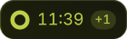
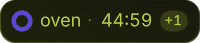
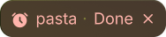
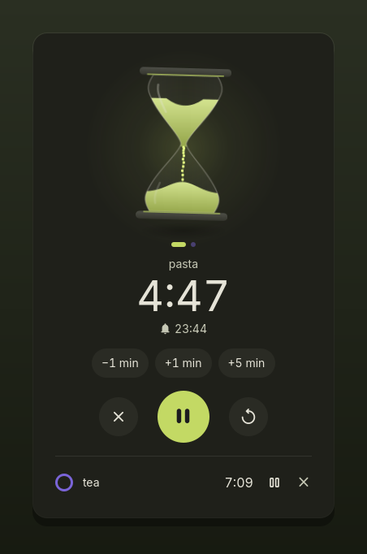
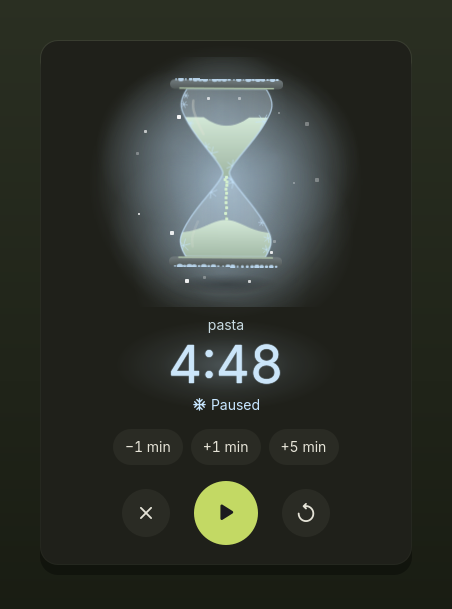
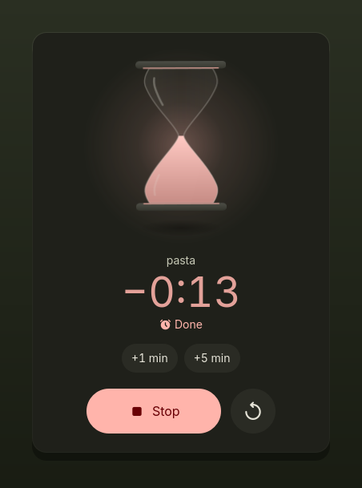
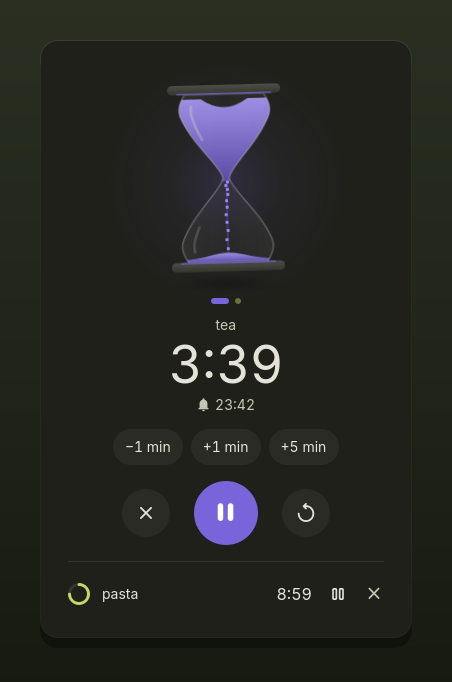
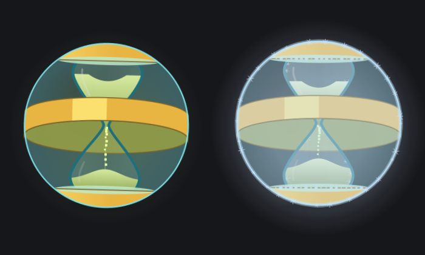
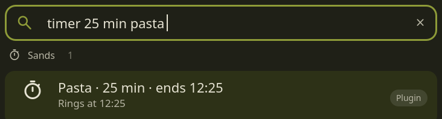

<div align="center">

# Sands

**A floating hourglass timer for [DankMaterialShell](https://github.com/AvengeMedia/DankMaterialShell).**

Type `timer 20 min pasta` in the launcher. Watch the sand fall in your bar.
Pause it and the whole thing freezes over.


</div>

> **New in 1.3.0:** ultra light. With the panel open, the whole shell used about one CPU core; it now costs a few percent (see [Performance](#performance)). See the [changelog](#changelog).

## Contents

- [Getting started](#getting-started)
- [Features](#features)
- [Usage](#usage)
- [Settings](#settings)
- [Command line and keybindings](#command-line-and-keybindings)
- [Troubleshooting](#troubleshooting)
- [Privacy](#privacy)
- [Performance](#performance)
- [Development](#development)
- [Changelog](#changelog)
- [Roadmap](#roadmap)
- [Credits](#credits)
- [License](#license)

## Getting started

### Requirements

| Dependency | Version | Needed for |
| --- | --- | --- |
| DankMaterialShell | 1.6.0 or newer | Everything |
| `pw-play` (PipeWire) | Any | The alarm sound (`paplay` is used as a fallback) |

### 1. Install

**From the plugin browser** (recommended): open **Settings → Plugins**, search for **Sands** and click *Install*.

**From a terminal:**

```sh
dms plugins install smartTimer
```

**Manually:**

```sh
git clone https://github.com/lung595/Sands ~/.config/DankMaterialShell/plugins/Sands
```

Then click **Settings → Plugins → *Scan for plugins***.

> [!NOTE]
> The plugin id is `smartTimer` (install command, IPC target, settings and saved state use it); the display name is **Sands**.

### 2. Enable

In **Settings → Plugins**, turn **Sands** on. From now on the launcher understands durations.

### 3. Add a widget

> [!IMPORTANT]
> **Enabling Sands is not enough to see it.** The bar pill and the hourglass panel only exist once you **add the Sands widget to your bar** yourself. Without it, the launcher still starts timers, but you have nothing to watch them in.

| Where | How to add it | What you get |
| --- | --- | --- |
| **Bar** | **Settings → Appearance → DankBar Layout**, add **Sands** to a section (the center looks best) | A pill with a draining ring while a timer runs; click it for the floating hourglass |

The pill only shows while a timer runs, so an empty bar after adding it is normal.

### 4. First steps

1. **Open the launcher and type a duration**, with an optional name: `timer 20 min pasta`, `1h30 oven`, `at 6pm`. No prefix needed.
2. **Watch the pill** in the bar: a ring drains until it rings. Scroll on it for ±1 minute, right-click to pause.
3. **Click the pill** for the floating hourglass: pause freezes it, restart flips it over.

Timers survive a DMS restart: they are stored as end times, not countdowns.

## Features

- **Zero forms.** One line in the launcher starts a timer: `25m`, `1h30 oven`, `at 6pm`, in English or French.
- **Zero clutter.** The bar pill only exists while a timer runs.
- **Zero guessing.** A ring drains in the bar; the sand in the panel is synced to the real remaining time *by volume*, not by height.
- **Several timers at once**, each with its own color.
- **Delightful, yet light.** The hourglass floats, flips when you restart and freezes when you pause, without redrawing anything it doesn't have to.
- **Matches your theme.** Every color comes from your DMS theme, static or generated from your wallpaper, and updates live. The screenshots use a lime theme; on the default purple theme, Sands is purple.

| When you… | Type |
| --- | --- |
| boil pasta, steep tea, bake | `timer 11 min pasta`, `4m tea`, `45 min oven` |
| focus in blocks | `25m focus`, then `5m break` from the recents |
| need to leave at a given time | `at 18:30 train`, `timer 7am wake up` |
| run several things at once | start as many as you want: each gets its own color |
| cook with the laundry going | `1h laundry` + `12m pasta`: the pill shows the next one, `+1` for the rest |
| play, meet, stretch | `timer 50 min meeting`, `timer 1 hour and a half` |
| want a timer without the mouse | bind a key to open the launcher pre-filled with `timer ` |

## Usage

### The bar pill

| | |
| --- | --- |
|  | **Running**: a ring drains, digits never jitter (tabular figures, fixed width). `+1` means another timer is running. |
|  | **Name on demand**: shown for two seconds when a timer starts, and whenever you hover. Hovering never opens anything. |
|  | **Done**: the pill grows red and breathes, the alarm loops, a notification offers *Stop* and *+5 min*. |

The ring turns amber during the last minute and beats during the last ten seconds.

| Gesture on the pill | Action |
| --- | --- |
| Left click | Open the panel (silences the alarm) |
| Right click | Pause / resume, or stop the alarm |
| Scroll | ±1 minute (scroll up on a finished timer = snooze 1 min) |
| Middle click | Cancel |

### The hourglass panel

<table>
<tr>
<td align="center"><br><b>Running</b></td>
<td align="center"><br><b>Paused, frozen</b></td>
</tr>
<tr>
<td align="center"><br><b>Done</b></td>
<td align="center"><br><b>Every timer has its color</b></td>
</tr>
</table>

- **A floating hourglass.** It levitates, tilts and casts a breathing shadow.
- **Sand synced by volume.** The bulbs' profile is integrated, so at half time exactly half the sand is left on top: a dip forms above, a mound grows below, grains stream through the neck.
- **Freeze on pause.** Time slows to a stop, grains hang mid-air, frost settles on the glass, a cold mist drifts, the digits turn ice-blue. It thaws just as smoothly.
- **Flip to restart.** The hourglass turns over and starts again.
- **Colors follow your theme.** The first timer uses your accent color; each additional timer gets a harmonious hue derived from it, used everywhere for that timer. Alerts use the theme's warning (last minute) and error (done) colors.

| Pause → freeze → thaw | Restart → flip |
| --- | --- |
|  |  |

| Gesture on the hourglass | Action |
| --- | --- |
| Click | Flip it (restart) |
| Scroll | ±1 minute |
| Swipe / horizontal scroll | Next or previous timer (dots show where you are) |
| <kbd>Space</kbd> / <kbd>Esc</kbd> | Pause–resume / close |

**Two hourglasses.** The classic one, or **Glass of Time**, a nod to *Steven Universe*: the glass floats in a cyan sphere with a gold ring around its waist. Only the frame changes; the sand, the freeze and the flip behave the same.



### The launcher



No prefix needed: Sands only answers when what you type looks like a duration, and stays silent for everything else. Type `timer` alone to get your most used timers first (frequent *and* recent), then 5, 10 and 25 min, then the running ones.

### Syntax

Type in English or French, words or digits, in any order:

| Input | Result |
| --- | --- |
| `20 min`, `20m`, `timer 20` | 20 minutes |
| `1h30`, `1h 30`, `1.5h`, `1,5 h`, `90 min` | 1 hour 30 |
| `1h30m20s`, `5m30`, `90s`, `1:30`, `1:02:03` | Exact durations (`1:30` = 1 min 30 s) |
| `half an hour`, `an hour and a half`, `twenty five minutes` | Spelled-out durations |
| `une demi-heure`, `trois quarts d'heure`, `2 heures et quart` | Same in French |
| `12 min pasta`, `pasta 12 min`, `pasta for 12 min` | A named timer |
| `at 18:30`, `at 6pm`, `at noon`, `à 18h` | An alarm at a time of day (tomorrow if already past) |
| `timer 14h30` | Offers both: *alarm at 14:30* first, *14 h 30 timer* second |

The interface is in English; the launcher understands English and French. Would you like Sands to understand another language? [Open an issue](https://github.com/lung595/Sands/issues) and say which one.

## Settings

Open **Settings → Plugins → Sands**.

| Setting | Description | Default |
| --- | --- | --- |
| Hourglass | Classic or Glass of Time | Classic |
| Sound | Any installed sound theme file, or your own `.oga/.ogg/.wav/.mp3/.flac` (with *Preview*) | Alarm clock |
| Volume | | 80 % |
| Alarm duration | The sound stops by itself; the pill keeps pulsing | 60 s |
| Gentle alarm | Starts at 30 %, rises to full volume | On |
| Final countdown ticks | A soft tick on each of the last 10 seconds | Off |
| Respect Do Not Disturb | No sound; the pill still pulses | On |
| Notification when done | With *Stop* and *+5 min* | On |
| Automatic detection / Prefix | Answer any duration typed in the launcher, or only after a prefix of your choice | Automatic detection |

DMS's *Reduce motion* setting is respected: no floating, no flip animation.

## Command line and keybindings

```sh
dms ipc call smartTimer start "12 min pasta"   # same syntax as the launcher
dms ipc call smartTimer toggle                 # pause/resume the next timer, or stop the alarm
dms ipc call smartTimer stop                   # stop the alarm, or cancel the next timer
dms ipc call smartTimer add 5                  # +5 min to the next timer
dms ipc call smartTimer list                   # list running timers
dms ipc call smartTimer clear                  # cancel every timer
dms ipc call smartTimer panel                  # open/close the panel on the focused screen
dms ipc call launcher openQuery "timer "       # launcher pre-filled, ready to type a duration
```

Bind them to keys in your compositor, for example:

**niri** (`~/.config/niri/config.kdl`):

```kdl
binds {
    Mod+T       { spawn "dms" "ipc" "call" "launcher" "openQuery" "timer "; }
    Mod+Shift+T { spawn "dms" "ipc" "call" "smartTimer" "panel"; }
}
```

**Hyprland**:

```ini
bind = SUPER, T, exec, dms ipc call launcher openQuery "timer "
bind = SUPER SHIFT, T, exec, dms ipc call smartTimer panel
```

> [!NOTE]
> `smartTimer panel` opens the panel of the bar widget, so it needs the widget in your bar (see [Add a widget](#3-add-a-widget)).

## Troubleshooting

<details>
<summary><b>I started a timer but see nothing in the bar.</b></summary>

Add the Sands widget to your bar: **Settings → Appearance → DankBar Layout → Sands**. See [Add a widget](#3-add-a-widget). The pill only shows while a timer runs.
</details>

<details>
<summary><b>The launcher does not suggest a timer.</b></summary>

Sands only answers what looks like a duration (`20 min`, `1h30`, `at 6pm`). If you turned **Automatic detection** off, type your **Prefix** first.
</details>

<details>
<summary><b>The alarm makes no sound.</b></summary>

Check that `pw-play` (or `paplay`) is installed, that **Volume** is not at 0, and that Do Not Disturb is off: with **Respect Do Not Disturb** on, the pill pulses silently.
</details>

## Privacy

- **No network access, no telemetry.**
- **Short-lived local tools only**: `pw-play` (or `paplay`) to ring, `notify-send` / `gdbus` for the notification, and a one-off `find` over the system sound folders while the settings page is open, to list the sounds you can pick.
- **Written to disk**, through DMS's own plugin state: your running timers (end times and labels, so they survive a restart) and your recent timers (to suggest them again in the launcher). Nothing else.
- **Settings** are stored by DMS with your other plugin settings.

## Performance

Sands costs nothing while you are not looking at it.

- **Engine**: wakes up exactly when a displayed second changes (about once per second), not at all when everything is paused. The sorted list is only recomputed when timers change.
- **Hourglass**: glass and sand are redrawn only when the sand level moves by at least a quarter pixel. Floating, grains and the flip are plain GPU transforms.
- **No looping QML animation.** A looping animation keeps Qt's shared animation clock ticking, and then *every* DMS window (bars, wallpaper) redraws at the display rate. Instead, one plain timer drives all the motion: 60 fps while grains fall or the bell shakes, 30 fps for slow motion. Only the window that shows it redraws.
- **Closed panel**: every animation stops.
- **Reduce motion**: the hourglass stops floating and flipping, the pill no longer beats or shakes, and the frost stays still.

Measured on a 240 Hz display, in % of one CPU core for the whole shell (DMS alone: about 2 %):

| Situation | 1.2.1 | 1.3.0 |
| --- | --- | --- |
| Timer running, panel closed | Same as DMS alone | Same as DMS alone (2.1 %) |
| Panel open, sand flowing | 87 % | 6.5 % |
| Panel open, paused (frozen) | 105 % | 3.9 % |

Counter-test: back on the 1.2.1 code, after a restart, the paused panel measured 105 % again, and 3.9 % once the fix was back. The gain comes from the fix, not from the restart.

## Development

### Project layout

```
Sands/
├── plugin.json                 # manifest (composite: daemon + bar widget + launcher)
├── TimerDaemon.qml             # engine: timers, persistence, sound, notifications, IPC
├── TimerWidget.qml             # bar pill + native DMS popout
├── TimerLauncher.qml           # launcher provider
├── TimerSettings.qml           # settings page
├── TimeParser.js               # natural-language parser + formatting (tested)
├── components/
│   ├── TimerPanelContent.qml   # panel: hourglass, time, controls, other timers
│   ├── Hourglass.qml           # the floating, volume-synced hourglass
│   ├── ProgressRing.qml        # the ring used in the pill and lists
│   ├── RoundButton.qml, Chip.qml
│   └── Motion.js               # looping motion as pure functions of time (tested)
├── tests/
│   ├── parser.test.js
│   └── motion.test.js
└── docs/images/                # screenshots and animations
```

### Tests

```sh
gjs tests/parser.test.js        # 91 parser tests
gjs tests/motion.test.js
```

## Changelog

### 1.3.0 (2026-09-26)

- Ultra light: the open panel no longer makes the whole shell redraw at the display rate. Open panel 87 % → 6.5 % of one CPU core, paused panel 105 % → 3.9 % (details in [Performance](#performance)). Same motion as before: same ranges, periods and easing.
- A ringing alarm left alone no longer keeps the shell busy: the pill breathes at 30 fps, and redraws only the bar.
- The interface is in English only; the *Language* setting and the `lang` command are gone. The launcher still understands English and French.
- The settings examples now show both input languages.
- With *Reduce motion*, the frozen aura no longer breathes.

### 1.2.1 (2026-09-26)

- *Reduce motion* is honored everywhere: no beat or bell shake in the pill, still frost crystals, and no frames at all while a paused hourglass stands still.
- New *Privacy* section in this README.
- Code comments and test output in English only.

### 1.2.0 (2026-09-26)

- New *Hourglass* setting: *Classic*, or *Glass of Time* (a nod to Steven Universe: the glass in a cyan sphere, a gold ring around the waist). Sand, freeze and flip behave the same.

### 1.1.0 (2026-09-24)

- First release: natural-language timers in French and English from the launcher, the bar pill with its ring, the floating hourglass that freezes when paused and flips on restart, several named timers with their own theme color, timers that survive a restart.
- Progressive ringing, a final tick, Do Not Disturb, a notification with Stop and +5 min, `dms ipc call smartTimer …` commands.

## Roadmap

Ideas, not promises, and no dates. Sands stays a simple timer: no network, nothing sent anywhere.

- **Easier to read code**: split the largest files (`TimerPanelContent.qml`, `Hourglass.qml`, `TimerDaemon.qml`) by role, without changing behavior.
- **More input languages**: the launcher understands English and French today. Other languages are added on request: [open an issue](https://github.com/lung595/Sands/issues) to ask for yours.

## Credits

- *Glass of Time* is a nod to *Steven Universe*; it is drawn from scratch.
- Built on [DankMaterialShell](https://github.com/AvengeMedia/DankMaterialShell) and [Quickshell](https://quickshell.org).

## License

[MIT](LICENSE) © lung595
