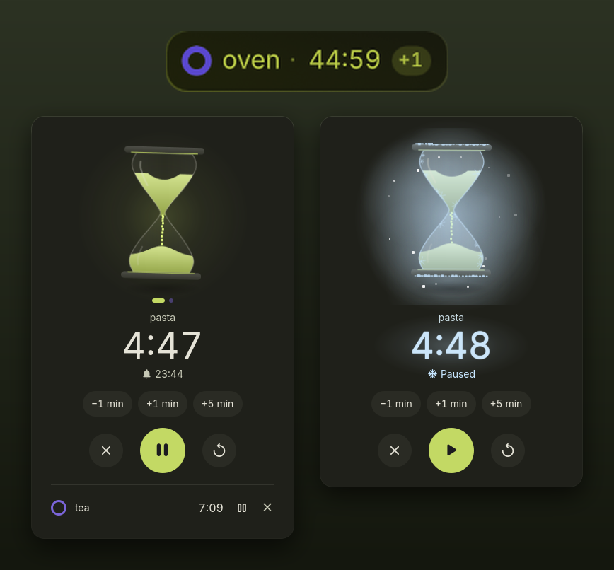
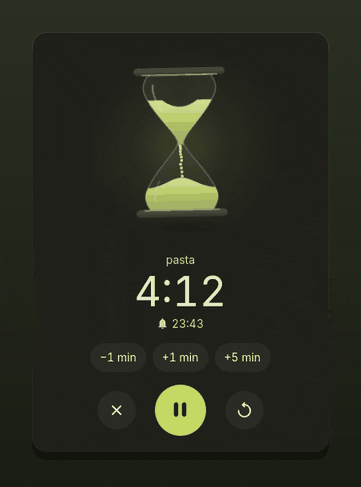
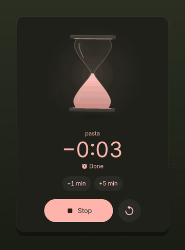

<div align="center">

# Sands

**A floating hourglass timer for [DankMaterialShell](https://github.com/AvengeMedia/DankMaterialShell).**

Type `timer 20 min pasta` in the launcher. Watch the sand fall in your bar.
Pause it and the whole thing freezes over.



[Getting started](#getting-started) · [Usage](#usage) · [Settings](#settings) · [Troubleshooting](#troubleshooting) · [User guide](docs/GUIDE.md) · [Changelog](CHANGELOG.md)

</div>

## Getting started

### Requirements

| Dependency | Version | Needed for |
| --- | --- | --- |
| DankMaterialShell | 1.6.0 or newer | Everything |
| `pw-play` (PipeWire) | Any | The alarm sound (`paplay` is used as a fallback) |
| `notify-send` (libnotify), `gdbus` (glib2) | Any | Notifications and Do Not Disturb |

### 1. Install

From the plugin browser: **Settings → Plugins**, search for **Sands**, click *Install*. Or from a terminal:

```sh
dms plugins install smartTimer
```

<details>
<summary>Manual install</summary>

```sh
git clone https://github.com/lung595/Sands ~/.config/DankMaterialShell/plugins/Sands
```

Then click **Settings → Plugins → *Scan for plugins***.
</details>

> [!NOTE]
> The plugin id is `smartTimer` (install command, IPC, settings); the display name is **Sands**.

### 2. Enable

In **Settings → Plugins**, turn **Sands** on. The launcher now understands durations.

### 3. Add a widget

> [!IMPORTANT]
> **Enabling Sands is not enough to see your timers.** The bar pill and the hourglass panel only exist once you **add the Sands widget to your bar** yourself.

| Where | How to add it |
| --- | --- |
| **Bar** | **Settings → Appearance → DankBar Layout**, add **Sands** to a section (the center looks best) |

The pill only shows while a timer runs, so an empty bar right after adding it is normal.

### 4. First steps

1. **Open the launcher and type a duration**, with an optional name: `timer 20 min pasta`, `1h30 oven`, `at 6pm`.
2. **Watch the pill** in the bar: a ring drains until it rings.
3. **Click the pill** for the floating hourglass: pause freezes it, the restart button flips it over.

## Features

| Pause → freeze → thaw | Restart → flip |
| --- | --- |
|  |  |

- **Zero forms**: one line in the launcher starts a timer, in English or French.
- **Zero clutter**: the bar pill only exists while a timer runs.
- **Sand synced by volume** to the real remaining time.
- **Several named timers** at once, each with its own color.
- **Survives a restart**: timers are stored as end times.
- **Matches your theme**, static or generated from your wallpaper.
- **Lightweight and private**: a few percent of CPU with the panel open, no network.

## Usage

### Launcher syntax

| Input | Result |
| --- | --- |
| `20 min`, `20m`, `timer 20` | 20 minutes |
| `1h30`, `1.5h`, `90 min`, `1:30:00` | 1 hour 30 |
| `half an hour`, `une demi-heure` | Spelled-out durations |
| `12 min pasta`, `pasta for 12 min` | A named timer |
| `4x 1h`, `1h x4` | Four timers of one hour (up to 20) |
| `at 18:30`, `at 6pm`, `à 18h` | An alarm at a time of day |

Type `timer` alone to get your most used timers; `timer stop` cancels one from the keyboard.

### Gestures

| On the pill | Action |
| --- | --- |
| Left click | Open the panel (silences the alarm) |
| Right click | Pause / resume, or stop the alarm |
| Scroll | ±1 minute |
| Middle click | Cancel |

| On the hourglass | Action |
| --- | --- |
| Click | A spin and hop, just for fun (the timer is untouched) |
| Restart button (↻) | Turns the hourglass over and starts again |
| Scroll | ±1 minute |
| Swipe / horizontal scroll | Next or previous timer |
| <kbd>Space</kbd> / <kbd>Esc</kbd> | Pause–resume / close |

📖 The full syntax, every state of the pill and panel, and the *Glass of Time* hourglass are in the **[user guide](docs/GUIDE.md)**.

## Settings

**Settings → Plugins → Sands.**

| Setting | Default |
| --- | --- |
| Hourglass: Classic or Glass of Time | Classic |
| Sound: a system sound or your own file | Alarm clock |
| Volume | 80 % |
| Alarm duration | 60 s |
| Notification when done (*Stop*, *+5 min*) | On |
| Gentle alarm (rises from 30 %) | On |
| Final countdown ticks | Off |
| Respect Do Not Disturb | On |
| Launcher: automatic detection, or a prefix | Automatic detection |

## Command line and keybindings

```sh
dms ipc call smartTimer start "12 min pasta"   # same syntax as the launcher
dms ipc call smartTimer toggle                 # pause/resume the next timer, or stop the alarm
dms ipc call smartTimer stop                   # stop the alarm, or cancel the next timer
dms ipc call smartTimer add 5                  # +5 min to the next timer
dms ipc call smartTimer list                   # list running timers
dms ipc call smartTimer clear                  # cancel every timer
dms ipc call smartTimer panel                  # open/close the panel (needs the bar widget)
dms ipc call launcher openQuery "timer "       # launcher pre-filled with "timer "
```

**niri** (`~/.config/niri/config.kdl`):

```kdl
binds {
    Mod+T       { spawn "dms" "ipc" "call" "launcher" "openQuery" "timer "; }
    Mod+Shift+T { spawn "dms" "ipc" "call" "smartTimer" "panel"; }
}
```

**Hyprland**:

```ini
bind = SUPER, T, exec, dms ipc call launcher openQuery "timer "
bind = SUPER SHIFT, T, exec, dms ipc call smartTimer panel
```

## Troubleshooting

| Problem | Solution |
| --- | --- |
| A timer runs but nothing shows in the bar | Add the widget, see [Add a widget](#3-add-a-widget) |
| The launcher does not suggest a timer | Type a duration (`20 min`); if *Automatic detection* is off, type your prefix first |
| The alarm makes no sound | Install `pw-play` or `paplay`, check the volume, turn off Do Not Disturb |

## Privacy

No network access, no telemetry. Only short-lived local tools run (`pw-play` to ring, `notify-send` for the notification). Your running and recent timers are saved by DMS, nothing else. Details in the [user guide](docs/GUIDE.md#privacy).

## Documentation

| File | Content |
| --- | --- |
| [docs/GUIDE.md](docs/GUIDE.md) | Full user guide |
| [CHANGELOG.md](CHANGELOG.md) | What changed in each version |
| [ROADMAP.md](ROADMAP.md) | Ideas for the future |
| [CONTRIBUTING.md](CONTRIBUTING.md) | Architecture, tests and release process, for anyone working on the code |

## Credits

*Glass of Time* is a nod to *Steven Universe*, drawn from scratch. Built on [DankMaterialShell](https://github.com/AvengeMedia/DankMaterialShell) and [Quickshell](https://quickshell.org).

## License

[MIT](LICENSE) © lung595
